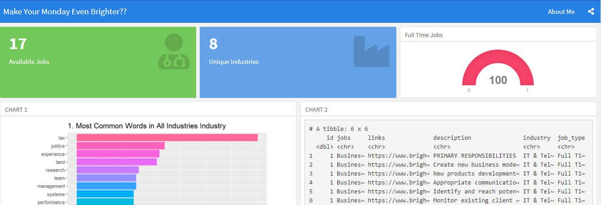
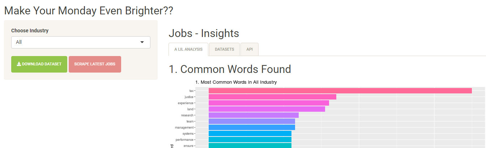

# Brighter Monday - Interview Home Project

{width="581"}

### Background

This is part of the home project from an interview i took recently. The goal was to write a script to get all data from [Brighter Monday Jobs](https://www.brightermonday.co.ug/jobs), store it in a database, create a dashboard and a mini web application.

### What included?

-   [Shiny App](https://simonsayz.shinyapps.io/brighter_monday/)
-   [Dashboard](https://rpubs.com/simonsayz/brighter_monday_dash)
-   Brighter Monday Scrapper

### Deployment

-   The [Shiny App](https://simonsayz.shinyapps.io/brighter_monday/) is hosted freely on [shiny io](https://www.shinyapps.io/)

-   The [Dashboard](https://rpubs.com/simonsayz/brighter_monday_dash) is hosted freely on [R Pubs](https://rpubs.com/)

-   You can run the scrapping script on your computer

### Usage

-   Clone the repo and Run **scrape\_bm.R**

-   Follow the Links to check out the Apps and the Dashboard

{width="591"}
